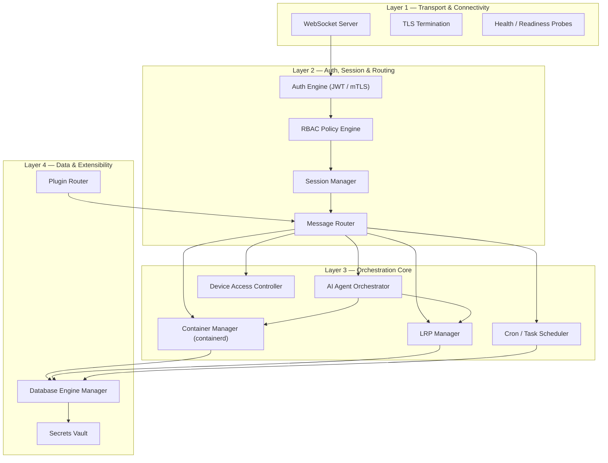
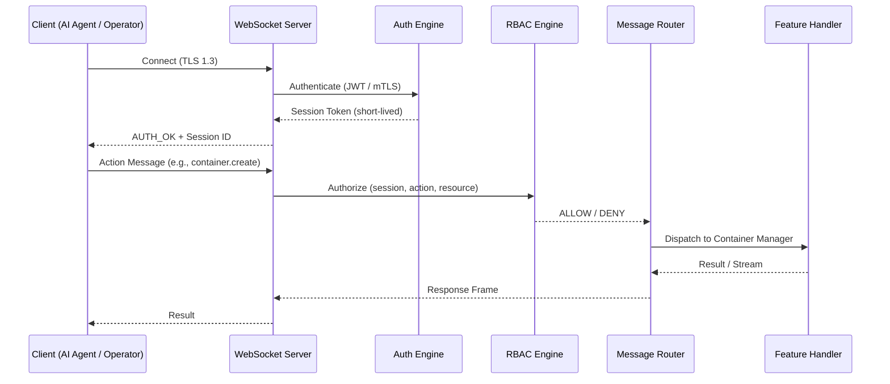
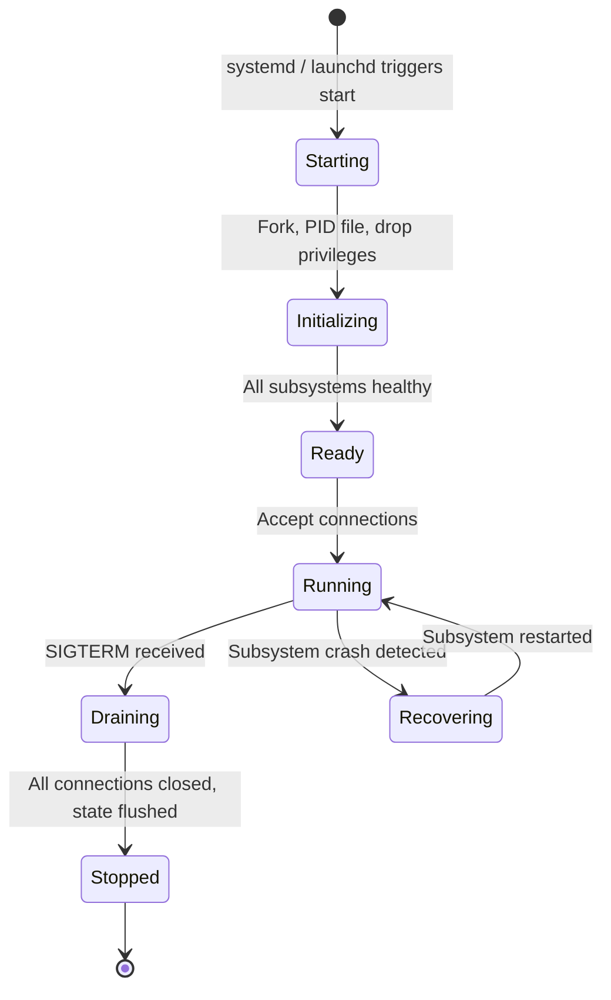

# Orchestrator System — High-Level Architecture Overview

## 1. Executive Summary

The Orchestrator System is a **host-level background daemon** that acts as the central nervous system of a machine. It exposes a secure WebSocket API through which authenticated clients — human operators, AI agents, CI/CD pipelines, or external plugins — can manage containers, long-running processes, scheduled tasks, database engines, and device-level hardware.

The system is designed around four concentric architectural layers and is strictly organised using **Feature-Driven Development (FDD)**.

---

## 2. Layered Architecture



### Layer 1 — Transport & Connectivity
| Component | Responsibility |
|---|---|
| **WebSocket Server** | Bidirectional, persistent connections. Supports binary (MessagePack) and text (JSON) frames. |
| **TLS Termination** | All connections encrypted via TLS 1.3. Supports both server-only and mutual TLS (mTLS). |
| **Health Probes** | HTTP `/healthz` and `/readyz` endpoints for external monitoring (systemd, k8s, etc.). |

### Layer 2 — Auth, Session & Routing
| Component | Responsibility |
|---|---|
| **Auth Engine** | Handles initial authentication (JWT bearer tokens, mTLS client certs). Issues short-lived session tokens. |
| **RBAC Policy Engine** | Evaluates every inbound message against a policy store (roles, permissions, resource scopes). |
| **Session Manager** | Tracks per-connection session state, token refresh lifecycle, and session-scoped resource quotas. |
| **Message Router** | Dispatches validated, authorised messages to the correct feature handler via a topic/action addressing scheme. |

### Layer 3 — Orchestration Core
| Component | Responsibility |
|---|---|
| **Container Manager** | Full lifecycle management via the containerd gRPC API: pull images, create/start/stop/remove containers, stream logs. |
| **LRP Manager** | Spawn, monitor (health checks, OOM tracking), log, and gracefully terminate long-running host processes. |
| **Cron / Task Scheduler** | Persistent, fault-tolerant scheduler. Jobs survive daemon restarts. Supports cron expressions and one-shot delayed tasks. |
| **AI Agent Orchestrator** | Coordinates AI agent workloads: allocates containers or LRPs for agents, streams I/O over WebSocket, manages agent lifecycle. |
| **Device Access Controller** | Governs host-level device access (USB, GPIO, filesystem mounts) through session-scoped permission grants. |

### Layer 4 — Data & Extensibility
| Component | Responsibility |
|---|---|
| **Database Engine Manager** | Provisions and manages database instances (SQLite, Postgres, Redis, etc.). Handles connection pooling, credential rotation, and encrypted access. |
| **Plugin Router** | Dynamic registration of external plugin services. Proxies requests to plugin endpoints with auth passthrough. |
| **Secrets Vault** | Encrypted-at-rest key/value store for credentials, API keys, and certificates. Supports auto-rotation policies. |

---

## 3. Data & Control Flow



### Message Envelope (JSON example)

```json
{
  "id": "msg_abc123",
  "type": "request",
  "topic": "container",
  "action": "create",
  "payload": {
    "image": "nginx:latest",
    "name": "web-proxy",
    "ports": [{"host": 8080, "container": 80}]
  },
  "meta": {
    "session_id": "sess_xyz",
    "timestamp": "2026-02-21T18:30:00Z",
    "trace_id": "trace_001"
  }
}
```

Every message follows this **topic.action** addressing pattern. Responses mirror the `id` for correlation. Streaming results use the same `id` with `type: "stream"` frames.

---

## 4. Daemon Lifecycle



- **Self-healing**: Subsystem crashes are isolated; the daemon supervisor restarts the failed component without dropping other connections.
- **Graceful shutdown**: On SIGTERM, the daemon stops accepting new connections, drains in-flight requests, flushes state, and exits.
- **PID file & socket activation**: Supports both traditional PID-file daemonization and modern socket-activation (systemd/launchd).

---

## 5. Security Model

| Concern | Approach |
|---|---|
| **Transport** | TLS 1.3 mandatory. Optional mTLS for service-to-service. |
| **Authentication** | JWT (RS256/EdDSA) or mTLS client certificates. |
| **Authorization** | RBAC with resource-scoped permissions. Policies stored in an embedded policy engine. |
| **Secrets** | Encrypted at rest (AES-256-GCM). In-memory decryption only. Auto-rotation support. |
| **Device Access** | Explicit session-scoped grants. Default-deny posture. Audit-logged. |
| **Audit** | Every mutation is logged with session ID, trace ID, timestamp, and outcome. |

---

## 6. Deployment Topology

The daemon runs as a **Node.js process** managed by the host's init system. Cross-platform support is a first-class requirement:

| Platform | Init System | Config |
|---|---|---|
| Linux | systemd | `orchestrator.service` unit file |
| macOS | launchd | `com.vloop.orchestrator.plist` |
| Windows | Windows Service | Registered via `node-windows` |
| WSL2 | systemd (same as Linux) | Standard Linux service |

All state (scheduler jobs, session data, audit logs) is persisted to a **password-protected, encrypted SQLite database** (AES-256 via SQLCipher / `better-sqlite3-multiple-ciphers`) to survive restarts. The `.db` file is unreadable without the encryption passphrase.
