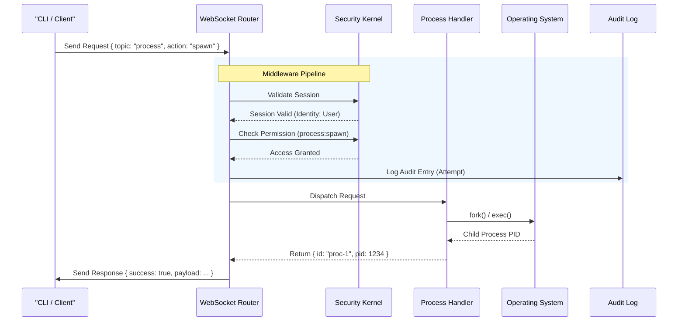

# Request Lifecycle & Data Flow

Understanding how data moves through vloop is critical for both security auditing and extension development. Every request, whether from a CLI command or an autonomous AI agent, follows a strict path through the system's security kernel before executing any logic.

## The Request Pipeline

1.  **Connection Establishment**:
    *   The client connects via WebSocket.
    *   An initial handshake validates the JWT token (if provided).
    *   A `Session` object is created and associated with the connection.

2.  **Message Dispatch**:
    *   The client sends a JSON message: `{ "topic": "process", "action": "spawn", "payload": { ... } }`.
    *   The `Router` receives the message and identifies the registered handler for the `process` topic.

3.  **Middleware Execution (The Security Kernel)**:
    *   **Authentication**: Verifies the session is valid and not expired.
    *   **Authorization (RBAC)**: The `PolicyEngine` checks if the session's roles allow `process:spawn` on the target resource.
    *   **Audit Logging**: The request is logged to the encrypted audit trail, recording *who*, *what*, and *when*.

4.  **Handler Execution**:
    *   The validated request is passed to the specific subsystem handler (e.g., `ProcessHandler`).
    *   The handler performs the business logic (e.g., spawning a child process).

5.  **Response**:
    *   The result (or error) is wrapped in a standard response envelope.
    *   The response is sent back to the specific client via WebSocket.

## Sequence Diagram

The following sequence diagram details the flow of a user requesting to spawn a new background process:

## AI Agent Data Flow

When an AI Agent is running, the flow is slightly more complex as it involves an internal feedback loop:

1.  **Trigger**: User sends a prompt to the `AgentOrchestrator`.
2.  **Context Retrieval**: The system fetches relevant memories from the `VectorStore` (RAG).
3.  **Inference**: The prompt + context is sent to the LLM Provider (e.g., OpenAI, Ollama).
4.  **Tool Selection**: The LLM decides to call a tool (e.g., `run_terminal_command`).
5.  **Loopback**: The tool execution request is routed *back* through the Security Kernel as if it were a user request, ensuring the Agent is subject to the same RBAC policies.
6.  **Execution**: The tool executes (e.g., runs `ls -la`).
7.  **Observation**: The output is fed back to the LLM as a new message.
8.  **Final Response**: The LLM generates the final answer based on the tool output.
