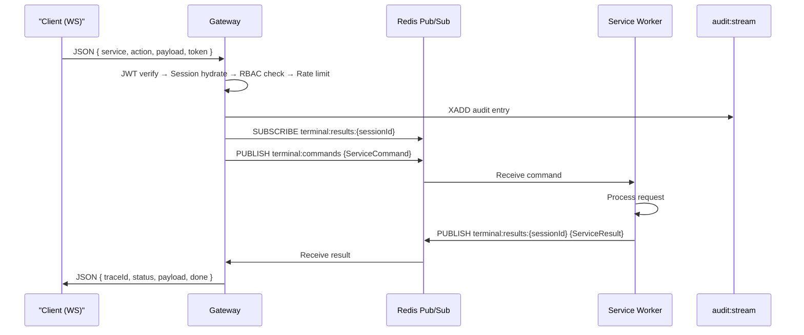

# Request Lifecycle & Data Flow

Understanding how data moves through vloop is critical for both security auditing and extension development. Every request, whether from a CLI command or an autonomous AI agent, follows a strict path through the system's security kernel before executing any logic.

## Architecture Modes

vloop supports two operational modes during the migration period:

### Legacy Mode (Direct WebSocket)
All services run in a single process. The daemon's Router dispatches directly to topic handlers.

### Event-Driven Mode (Gateway + Redis)
Enabled when `REDIS_URL` is set. The Gateway is the sole client-facing entry point. Services are isolated workers communicating through Redis pub/sub channels.

## The Request Pipeline (Event-Driven Mode)

1.  **Connection Establishment**:
    *   The client connects via WebSocket to the Gateway (port 9090).
    *   JWT token is validated on each message.
    *   A `Session` object is stored in Redis HSET `ws:sessions:{connId}`.

2.  **Message Dispatch**:
    *   The client sends a JSON message: `{ "service": "terminal", "action": "spawn", "payload": { ... } }`.
    *   The Gateway validates the message against Zod schemas.

3.  **Middleware Execution (Gateway Pipeline)**:
    *   **JWT Verification**: RS256 token validation.
    *   **Session Hydration**: Load/update session from Redis.
    *   **RBAC Check**: Deny-wins policy engine with glob matching.
    *   **Rate Limiting**: Per-user token bucket.
    *   **Audit Logging**: XADD to `audit:stream`.

4.  **Event Publishing**:
    *   The Gateway builds a `ServiceCommand` with traceId, userId, roles.
    *   Published to the service's command channel (e.g., `terminal:commands`).
    *   Gateway subscribes to `terminal:results:{sessionId}` for the reply.

5.  **Service Execution**:
    *   The service worker receives the command from Redis.
    *   Validates and processes the request.
    *   Publishes results to the per-session reply channel.

6.  **Response Delivery**:
    *   Gateway receives the result from Redis.
    *   Forwards the JSON response to the client over WebSocket.
    *   Streaming results are forwarded incrementally (with `done: false`).

## The Request Pipeline (Legacy Mode)

1.  **Connection Establishment**:
    *   The client connects via WebSocket (msgpack protocol).
    *   An initial handshake validates the JWT token (if provided).
    *   A `Session` object is created and associated with the connection.

2.  **Message Dispatch**:
    *   The client sends a msgpack message: `{ "topic": "process", "action": "spawn", "payload": { ... } }`.
    *   The `Router` receives the message and identifies the registered handler for the `process` topic.

3.  **Middleware Execution (The Security Kernel)**:
    *   **Authentication**: Verifies the session is valid and not expired.
    *   **Authorization (RBAC)**: The `PolicyEngine` checks if the session's roles allow `process:spawn` on the target resource.
    *   **Audit Logging**: The request is logged to the encrypted audit trail.

4.  **Handler Execution**:
    *   The validated request is passed to the specific subsystem handler (e.g., `ProcessHandler`).
    *   The handler performs the business logic (e.g., spawning a child process).

5.  **Response**:
    *   The result (or error) is wrapped in a standard response envelope.
    *   The response is sent back to the specific client via WebSocket.

## Sequence Diagram (Event-Driven)

## AI Agent Data Flow

When an AI Agent is running, the flow is slightly more complex as it involves an internal feedback loop:

1.  **Trigger**: User sends a prompt to the `ai:requests` channel via Gateway.
2.  **Context Retrieval**: The AI service fetches relevant memories from the store.
3.  **Inference**: The prompt + context is sent to the LLM Provider (e.g., OpenAI, Ollama).
4.  **Tool Selection**: The LLM decides to call a tool (e.g., `run_terminal_command`).
5.  **Loopback**: The tool execution request is routed *back* through the RBAC layer, ensuring the Agent is subject to the same policies as the user.
6.  **Execution**: The tool executes (e.g., runs `ls -la`).
7.  **Observation**: The output is fed back to the LLM as a new message.
8.  **Streaming**: Intermediate tokens are streamed back through the reply channel to the client.
9.  **Final Response**: The LLM generates the final answer based on the tool output.
