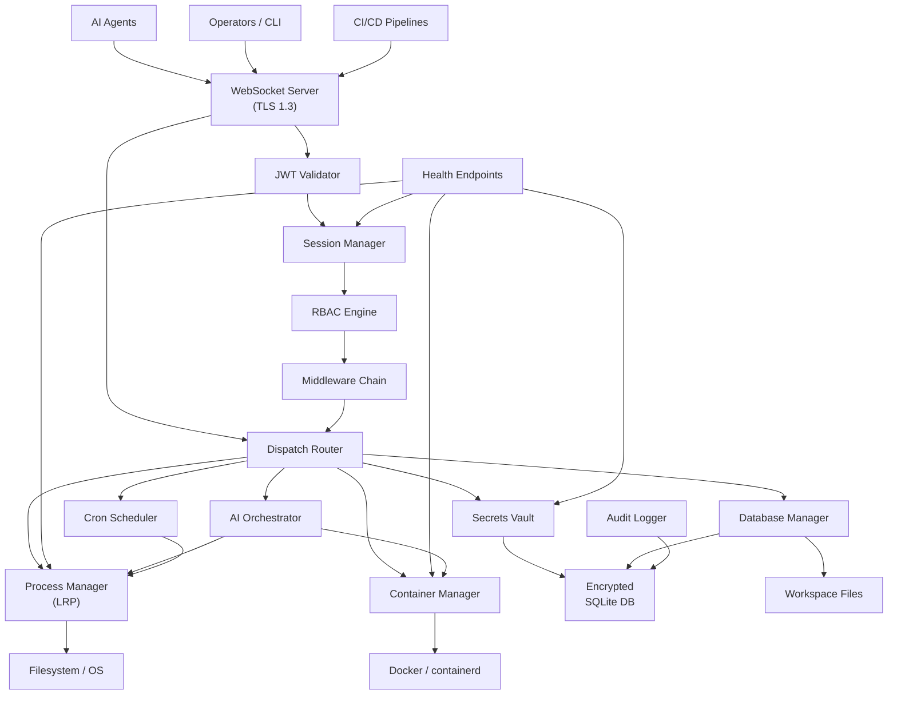
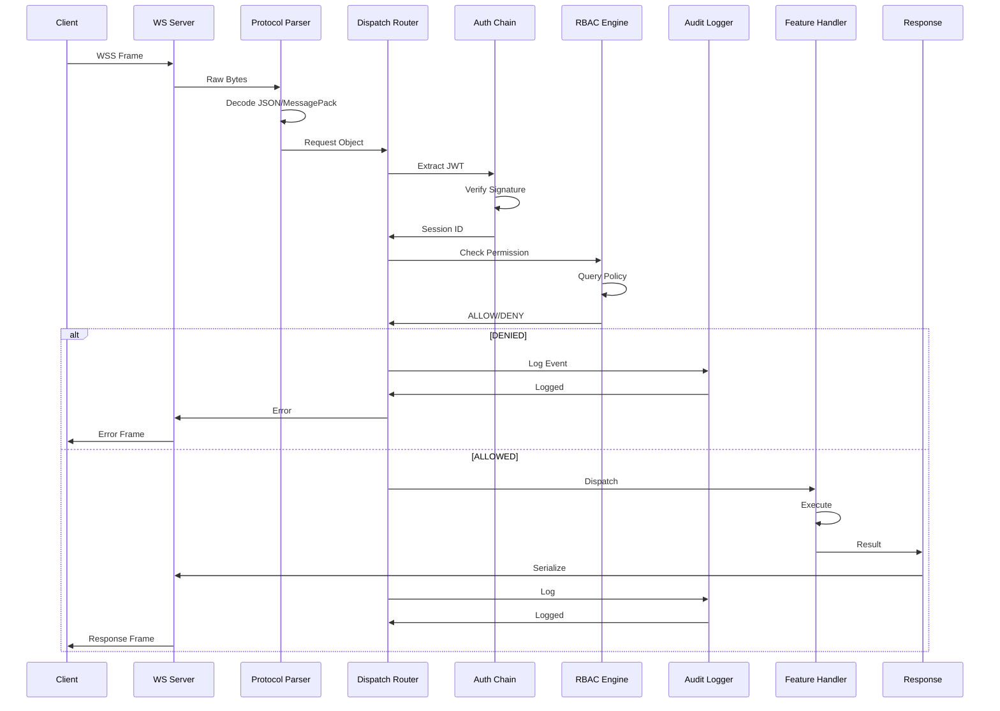
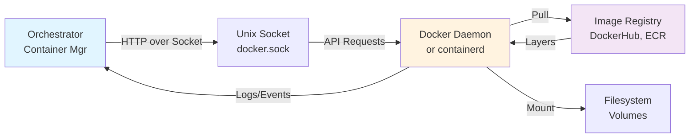
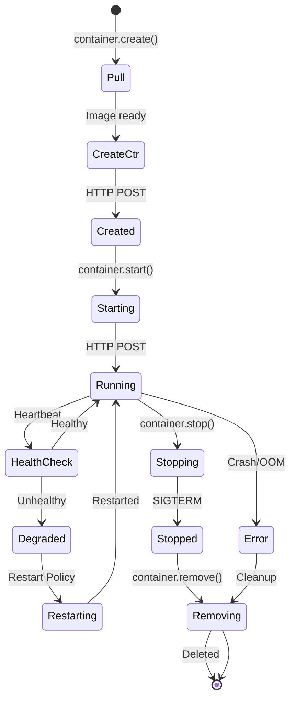
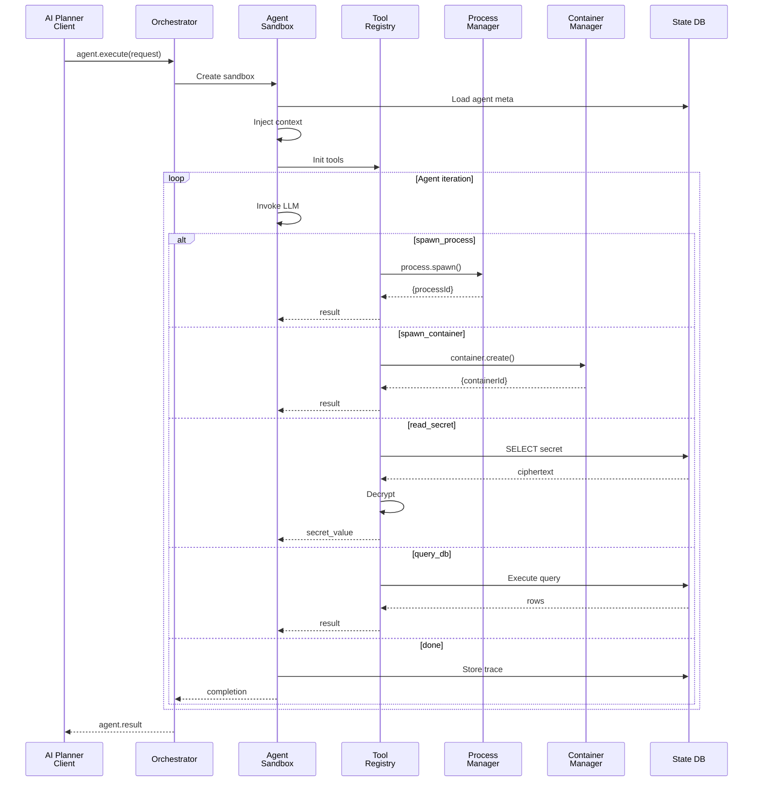
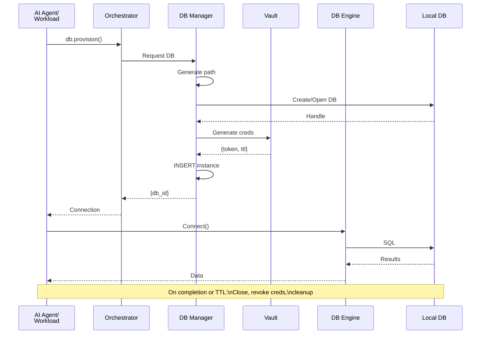
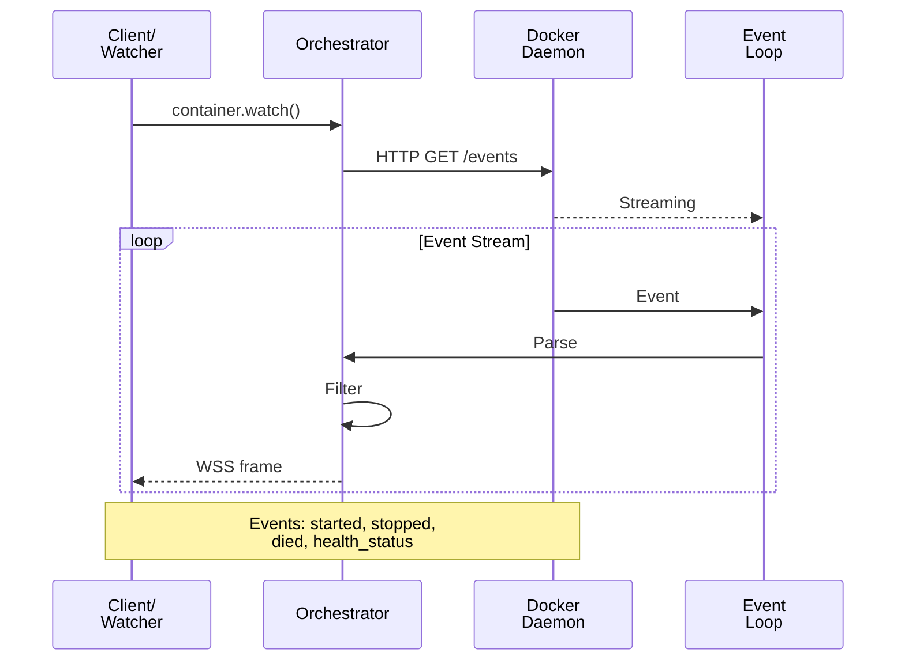

# Orchestrator System — Comprehensive Data Flow Diagrams (DFD)

**Document Purpose:** Detail all major data flows, message transformations, and architectural patterns governing data movement through the Orchestrator daemon and its constituent subsystems.

---

## Table of Contents

1. [DFD Level 0: Context Diagram](#dfd-level-0-context-diagram)
2. [DFD Level 1: Major Subsystems](#dfd-level-1-major-subsystems)
3. [DFD Level 2: Component Interactions](#dfd-level-2-component-interactions)
4. [Data Stores & Schemas](#data-stores--schemas)
5. [External Systems Integration](#external-systems-integration)
6. [Feature-Specific Flows](#feature-specific-flows)
   - [Container Lifecycle Flow](#container-lifecycle-flow)
   - [Process Execution Flow](#process-execution-flow)
   - [AI Agent Orchestration Flow](#ai-agent-orchestration-flow)
   - [Secrets Vault Access Flow](#secrets-vault-access-flow)
   - [Database Provisioning Flow](#database-provisioning-flow)
7. [Authentication & Authorization Flow](#authentication--authorization-flow)
8. [Event Streaming & Bidirectional Communication](#event-streaming--bidirectional-communication)
9. [Data Transformation Pipelines](#data-transformation-pipelines)
10. [Error & Recovery Flows](#error--recovery-flows)

---

## DFD Level 0: Context Diagram

**Level 0 shows the entire system as a single process and its external entities.**

```
                                    ┌────────────────────────────────┐
                                    │  AI Agents / Clients           │
                                    │  (Remote Planners, Operators)  │
                                    └────────────┬───────────────────┘
                                                 │
                      ┌──────────────────────────┼──────────────────────────┐
                      │                          │                          │
                      │    WSS RPC Messages      │    JWT / mTLS Certs      │
                      │    JSON/MessagePack      │                          │
                      │                          │                          │
                      ▼                          ▼                          ▼
                    ┌────────────────────────────────────────────────────┐
                    │   ORCHESTRATOR DAEMON (Host-Level System)          │
                    │                                                    │
                    │  ┌──────────────────────────────────────────────┐ │
                    │  │  • Workload Execution                        │ │
                    │  │  • Secrets Management & Injection            │ │
                    │  │  • Database Engine Provisioning              │ │
                    │  │  • AI Agent Sandbox & Tool Execution         │ │
                    │  │  • Session Management & RBAC                 │ │
                    │  │  • Audit Logging & Compliance Tracking       │ │
                    │  │  • Event Streaming & Bidirectional Comms     │ │
                    │  └──────────────────────────────────────────────┘ │
                    │                                                    │
                    └──────────┬──────────────────┬──────────────────┬───┘
                               │                  │                  │
                    ┌──────────▼──────┐  ┌────────▼────────┐  ┌──────▼──┐
                    │ Container       │  │ OS Kernel      │  │          │
                    │ Runtime         │  │ (Processes)    │  │          │
                    │ Docker/         │  │                │  │          │
                    │ containerd      │  │ Fork/Exec LRPs │  │          │
                    └──────────┬──────┘  │ Reap Signals   │  │          │
                               │         └────────────────┘  │          │
                               │                             │          │
                               └─────────────────────────┬───┘          │
                                                        │               │
                                    ┌───────────────────▼───────────┐
                                    │   Local Filesystem            │
                                    │  • Encrypted SQLite DB        │
                                    │  • Workspace Data             │
                                    │  • Logs & Audit Trails        │
                                    └───────────────────────────────┘
```

**Data Flow Summary (Level 0):**
- **Input:** WebSocket RPC requests (container ops, process spawning, secret requests, agent commands)
- **Processing:** Route → Authenticate → Authorize → Execute → Log
- **Output:** RPC responses (success/error), event streams, audit events
- **Storage:** Encrypted SQLite database for all persistent state

---

## DFD Level 1: Major Subsystems

**Level 1 decomposes the daemon into its major feature domains and shows their relationships.**



**Key Subsystems (Level 1):**
1. **Transport:** WSS server, TLS termination, protocol negotiation
2. **Auth & Security:** JWT validation, session tracking, RBAC enforcement, audit logging
3. **Routing:** Message routing, middleware composition, error boundary
4. **Features:** Independent domain managers (Process, Container, Vault, Agent, DB, Cron)
5. **Storage:** Encrypted SQLite for all persistent state

---

## DFD Level 2: Component Interactions

**Level 2 shows detailed message flows and transformation at the component level.**

### 2.1 Inbound Request Flow (Detailed)



### 2.2 State Mutation & Persistence

```
   Request Payload        Handler Execution         Database Write
   ───────────────────    ──────────────────       ──────────────────
   
   {payload}              1. Validate schema      1. Begin transaction
                          2. Allocate resources   2. Insert/Update row
                          3. Persist to DB        3. Commit
                          4. Return ID            4. Emit audit event
                          5. Schedule monitoring
```

---

## Data Stores & Schemas

### 3.1 Encrypted SQLite Database Schema

```sql
-- Core Database @ ./data/state.db, encrypted with AES-256-GCM

-- Sessions: Tracks authenticated client connections
CREATE TABLE sessions (
  id TEXT PRIMARY KEY,
  identity TEXT NOT NULL,
  roles TEXT NOT NULL,
  jwt_sub TEXT,
  issued_at INTEGER,
  expires_at INTEGER,
  last_activity INTEGER,
  metadata JSON,
  revoked BOOLEAN DEFAULT FALSE
);

-- Audit Log: Immutable record of all mutations
CREATE TABLE audit_log (
  id INTEGER PRIMARY KEY AUTOINCREMENT,
  session_id TEXT NOT NULL,
  trace_id TEXT,
  timestamp INTEGER NOT NULL,
  identity TEXT NOT NULL,
  action TEXT NOT NULL,
  resource_type TEXT,
  resource_id TEXT,
  payload_hash TEXT NOT NULL,
  prev_hash TEXT,
  outcome TEXT,
  error_code TEXT,
  details JSON
);
CREATE INDEX audit_log_session_id ON audit_log(session_id);
CREATE INDEX audit_log_identity ON audit_log(identity);
CREATE INDEX audit_log_timestamp ON audit_log(timestamp);

-- Secrets: Encrypted vault entries
CREATE TABLE secrets (
  id TEXT PRIMARY KEY,
  namespace TEXT NOT NULL,
  name TEXT NOT NULL,
  secret_type TEXT,
  ciphertext BLOB NOT NULL,
  iv BLOB NOT NULL,
  auth_tag BLOB NOT NULL,
  created_at INTEGER,
  updated_at INTEGER,
  created_by TEXT,
  rotated_count INTEGER DEFAULT 0,
  soft_delete_at INTEGER
);

-- Processes: Long-running process state
CREATE TABLE processes (
  id TEXT PRIMARY KEY,
  command TEXT NOT NULL,
  args JSON,
  cwd TEXT,
  env JSON,
  restart_policy TEXT,
  max_restarts INTEGER DEFAULT 5,
  restart_count INTEGER DEFAULT 0,
  pid INTEGER,
  exit_code INTEGER,
  status TEXT,
  created_at INTEGER,
  started_at INTEGER,
  stopped_at INTEGER,
  last_restart_at INTEGER
);

-- Containers: Container lifecycle tracking
CREATE TABLE containers (
  id TEXT PRIMARY KEY,
  image_ref TEXT NOT NULL,
  name TEXT UNIQUE NOT NULL,
  status TEXT,
  container_id TEXT,
  config JSON,
  created_at INTEGER,
  started_at INTEGER,
  stopped_at INTEGER,
  health_status TEXT,
  requested_by TEXT
);

-- Scheduled Jobs: Cron and scheduled task tracking
CREATE TABLE scheduled_jobs (
  id TEXT PRIMARY KEY,
  schedule_expr TEXT NOT NULL,
  command TEXT NOT NULL,
  args JSON,
  timezone TEXT DEFAULT 'UTC',
  next_run_at INTEGER,
  last_run_at INTEGER,
  last_exit_code INTEGER,
  created_at INTEGER,
  last_updated INTEGER,
  enabled BOOLEAN DEFAULT TRUE,
  retry_count INTEGER DEFAULT 0
);

-- Database Instances: Provisioned databases for workloads
CREATE TABLE database_instances (
  id TEXT PRIMARY KEY,
  engine TEXT NOT NULL,
  workspace_id TEXT,
  name TEXT,
  connection_string BLOB,
  created_at INTEGER,
  expires_at INTEGER,
  accessed_at INTEGER,
  creator_identity TEXT
);
```

### 3.2 File System Layout

```
/var/lib/orchestrator/
├── data/
│   ├── state.db
│   ├── state.db-wal
│   └── workspaces/
│       ├── <workspace-id>/
│       │   ├── env.json
│       │   ├── instance.db
│       │   └── artifacts/
│       └── ...
├── logs/
│   ├── daemon.log
│   └── access.log
└── certs/
    ├── server.crt
    ├── server.key
    └── ca.crt
```

---

## External Systems Integration

### 4.1 Container Runtime (Docker/containerd)



**Container Manager Data Flow:**
```
1. Client RPC: container.create(image, name, config)
   ↓
2. Image Validation (local cache check)
   ↓
3. If missing: Registry Pull (async)
   ↓
4. HTTP POST /containers/create over Unix socket
   ↓
5. Docker returns container ID
   ↓
6. Database entry: INSERT containers(...)
   ↓
7. Return container_id to client
   ↓
8. container.start(container_id)
   ↓
9. HTTP POST /containers/{id}/start
   ↓
10. Stream logs: Continuous WSS frames to client
```

### 4.2 OS Process Spawning

```
1. Client RPC: process.spawn(command, args, env, restartPolicy)
   ↓
2. Validation: command exists, args array, restart policy enum
   ↓
3. Allocate process object (ID generation)
   ↓
4. Database: INSERT processes(...)
   ↓
5. child_process.spawn(command, args, {env, stdio})
   ↓
6. Pipes: stdout and stderr to ring buffer
   ↓
7. Store PID, mark status='running'
   ↓
8. Monitor child:
    - on 'exit' → capture exit_code
    - Health check (heartbeat, memory, CPU)
    - Restart logic (if enabled)
   ↓
9. Event streaming to client: process.logs, process.status
```

---

## Feature-Specific Flows

### 5.1 Container Lifecycle Flow



### 5.2 Process Execution Flow

```
┌──────────────────────────────────────────────────────────────┐
│              Process Lifecycle                               │
└──────────────────────────────────────────────────────────────┘

    Client Request
    process.spawn({...})
         │
         ▼
    ┌──────────────────────────────────────┐
    │  Validation & Persistence              │
    │  • Command validation                  │
    │  • DB INSERT processes                 │
    │  • Generate unique ID                  │
    └──────────┬───────────────────────────┘
               │
               ▼
    ┌──────────────────────────────────────┐
    │  child_process.spawn()                 │
    │  • Fork into child                     │
    │  • Set stdio pipes                     │
    │  • Set environment variables           │
    └──────────┬───────────────────────────┘
               │
         ┌─────┴─────┐
         │           │
         ▼           ▼
    ┌────────┐  ┌──────────┐
    │ stdout │  │ stderr   │
    └────┬───┘  └────┬─────┘
         │           │
         ▼           ▼
    ┌──────────────────────────────────────┐
    │  Ring Buffer                           │
    │  • Last 1000 lines                     │
    │  • UTF-8 parsing                       │
    └────────┬───────────────────────────┘
             │
             ▼
    ┌──────────────────────────────────────┐
    │  WebSocket Event Emission              │
    │  process.logs {lines, cursor}         │
    └──────────────────────────────────────┘

    ┌──────────────────────────────────────┐
    │  Process Monitoring Loop              │
    │  • Poll exit code                      │
    │  • Heartbeat                           │
    │  • Restart on failure                  │
    └──────────────────────────────────────┘
```

### 5.3 AI Agent Orchestration Flow



### 5.4 Secrets Vault Access Flow

```
Client RPC: vault.secret.get(name)
    │
    ▼
┌───────────────────────────┐
│  RBAC Check                │
│  (vault:secret.get)       │
└─────────┬─────────────────┘
          │
    ┌─────▼──────┐
    │  ALLOWED?  │
    └─────┬──────┘
          │
    ┌─────▼──────────────────────────────┐
    │  Database Query                     │
    │  SELECT ciphertext, iv, auth_tag   │
    │  FROM secrets WHERE name = ?       │
    └─────┬──────────────────────────────┘
          │
    ┌─────▼──────────────────────────────┐
    │  Vault Crypto Module                │
    │  • Get Master Encryption Key        │
    │  • Decrypt: AES-256-GCM             │
    │    - ciphertext                      │
    │    - IV                              │
    │    - auth_tag validation             │
    └─────┬──────────────────────────────┘
          │
    ┌─────▼──────────────────────────┐
    │  Environment Injection           │
    │  • Set env var from plaintext    │
    │  • Never write to disk           │
    │  • Plaintext only in memory      │
    └──────────────────────────────┬─┘
                                   │
                                   ▼
                           Return to client
                           or inject into
                           subprocess
```

### 5.5 Database Provisioning Flow



---

## Authentication & Authorization Flow

### 6.1 JWT Authentication & Session Establishment

```
┌─────────────────────────────────────────────────────────────┐
│          JWT Authentication Flow                            │
└─────────────────────────────────────────────────────────────┘

1. Client Initial Connection
   
   Client sends:
   {
     "token": "eyJhbGciOiJSUzI1NiI...",
     "protocol": "json"
   }
         │
         ▼
   ┌──────────────────────────────────┐
   │  JWT Validator                    │
   │  • Load public key                │
   │  • Verify signature (RS256)       │
   │  • Check iat, exp, aud, iss       │
   └──────────┬───────────────────────┘
              │
   If FAILS:
   ├─→ AUTH_FAILED
   └─→ Close connection
   
   If PASSES:
         │
         ▼
   ┌──────────────────────────────────┐
   │  Extract Claims                   │
   │  • sub (subject)                  │
   │  • aud (audience)                 │
   │  • scope (if present)             │
   │  • custom fields                  │
   └──────────┬───────────────────────┘
              │
         ▼
   ┌──────────────────────────────────┐
   │  Session Creation                 │
   │  • Generate session_id (uuid)     │
   │  • Determine roles from claims    │
   │  • Store in sessions table        │
   │  • Record issued_at, expires_at  │
   └──────────┬───────────────────────┘
              │
         ▼
   Return: {
     session_id: "sess_abc123",
     identity: "user@org",
     roles: ["admin"]
   }

2. Subsequent Request Flow
   
   Client sends RPC with session_id in meta:
   {
     "id": "msg_1",
     "topic": "process",
     "meta": {
       "session_id": "sess_abc123"
     }
   }
         │
         ▼
   ┌───────────────────────────────┐
   │  Session Lookup               │
   │  • Query sessions table        │
   │  • Check: not revoked         │
   │  • Check: not expired         │
   │  • Check: active              │
   └───────┬───────────────────────┘
           │
   If invalid:
   ├─→ AUTH_REQUIRED
   └─→ Close
   
   If valid:
           │
           ▼
   ┌──────────────────────────────────┐
   │  Update Last Activity              │
   │  UPDATE sessions SET last_activity │
   └──────────────────────────────────┘
```

### 6.2 Role-Based Access Control (RBAC) Enforcement

```
Inbound RPC Request
Request: {topic: "vault", action: "secret.delete"}
         │
         ▼
┌─────────────────────────────────┐
│  Extract Authorization Context   │
│  • Identity: "alice@org"         │
│  • Roles: ["viewer", "operator"] │
└──────────┬────────────────────┘
           │
      ┌────▼─────────────────────┐
      │  Policy Matching          │
      └────┬────────────────────┘
           │
      ┌────▼─────────────────────────────┐
      │  Load RBAC Rules (policies.toml)  │
      │                                   │
      │  [roles.viewer]                   │
      │  allow = ["vault:secret.get:*"]  │
      │                                   │
      │  [roles.operator]                 │
      │  allow = ["container:*:*", ...]  │
      └────┬────────────────────────────┘
           │
      ┌────▼──────────┐
      │  Permission?  │
      └────┬──────────┘
           │
      Requested: vault:secret.delete:*
      User Roles: ["viewer", "operator"]
      Allowed by viewer: no
      Allowed by operator: no
           │
           ▼
       PERMISSION DENIED
```

---

## Event Streaming & Bidirectional Communication

### 7.1 Log Streaming Architecture

```
┌────────────────────────────────────────────────────┐
│  Long-Running Process (spawned via spawn())        │
└────────────┬───────────────────────────────────────┘
             │
    ┌────────┴────────┐
    │                 │
    ▼                 ▼
┌────────┐       ┌──────────┐
│ stdout │       │ stderr   │
└───┬────┘       └────┬─────┘
    │                 │
    └────────┬────────┘
             │
             ▼
    ┌───────────────────────┐
    │  Ring Buffer          │
    │  • Last 1000 lines    │
    │  • UTF-8 parsing      │
    │  • Cursor tracking    │
    └────────┬──────────────┘
             │
    ┌────────┴────────┐
    │                 │
    ▼                 ▼
Historical Tail   Event Stream
(on request)      (continuous)

Client: process.logs.tail(processId)
  ↓
Return: {lines, cursor}

  vs.

Client: Subscribe to stream
  ↓
Server (every 100ms or 50 lines):
{
  type: "stream",
  payload: {
    processId, lines, cursor
  }
}
```

### 7.2 Container Event Streaming



---

## Data Transformation Pipelines

### 8.1 Inbound Message Transformation

```
Raw WebSocket Frame
         │
         ▼
┌──────────────────────────────┐
│  Protocol Detection & Parsing │
│  • MessagePack or JSON        │
└──────────┬───────────────────┘
           │
           ▼
┌──────────────────────────────┐
│  Request Schema Validation    │
│  Zod: {                      │
│    id: string,               │
│    topic: enum,              │
│    action: string,           │
│    payload: unknown,         │
│    meta: {...}               │
│  }                           │
└──────────┬───────────────────┘
           │
    ┌──────▼──────┐
    │  Valid?     │
    └──────┬──────┘
           │
  Yes      │      No
   │       │       │
   │       └───────┼─────┐
   │               │     │
   ▼               │     ▼
Continue       Schema   Error
               Error    Response

           │
           ▼
┌──────────────────────────────┐
│  Feature-Specific Validation  │
│  Handler validation           │
└──────────┬───────────────────┘
           │
           ▼
┌──────────────────────────────┐
│  Enriched Request Context     │
│  {                           │
│    request,                  │
│    session,                  │
│    identity,                 │
│    logger,                   │
│    trace_id                  │
│  }                           │
└──────────────────────────────┘
```

### 8.2 Response Transformation & Serialization

```
Handler Result
{processId, pid, status}
         │
         ▼
┌──────────────────────────────┐
│  Response Envelope Wrapping   │
│  {                           │
│    id,                       │
│    type: "response",         │
│    topic,                    │
│    action,                   │
│    payload,                  │
│    meta: {timestamp, trace}  │
│  }                           │
└──────────┬───────────────────┘
           │
           ▼
┌──────────────────────────────┐
│  Negotiated Serialization     │
│  • MessagePack (compact)     │
│  • or JSON (readable)        │
└──────────┬───────────────────┘
           │
           ▼
┌──────────────────────────────┐
│  WebSocket Frame Framing      │
└──────────┬───────────────────┘
           │
           ▼
┌──────────────────────────────┐
│  TLS Encryption (WSS)         │
│  • TLS 1.3                    │
│  • AES-256-GCM                │
└──────────┬───────────────────┘
           │
           ▼
    Transmitted to Client
```

---

## Error & Recovery Flows

### 9.1 Error Boundary & Recovery

```
Handler Execution
         │
         ▼
┌─────────────────────┐
│  Catch Exception    │
│  try { exec() }     │
└────────┬────────────┘
         │
   ┌─────▼────┐
   │  Caught? │
   └─────┬────┘
         │
  Yes    │    No
   │     │     │
   │     │     └──→ Graceful return
   │     │
   ▼     
┌──────────────────────────────┐
│  Error Classification         │
│  • OrchestratorError          │
│  • Runtime Error              │
│  • Unknown Error              │
└─────────┬────────────────────┘
          │
          ▼
┌──────────────────────────────┐
│  Extract Error Context        │
│  • Error code                  │
│  • Message                     │
│  • Stack trace (debug mode)    │
│  • User-facing message         │
└─────────┬────────────────────┘
          │
          ▼
┌──────────────────────────────┐
│  Audit Log Entry              │
│  {                           │
│    action,                   │
│    outcome: "FAILURE",       │
│    error_code,               │
│    error_message,            │
│    timestamp                 │
│  }                           │
└─────────┬────────────────────┘
          │
          ▼
┌──────────────────────────────┐
│  Response to Client           │
│  {                           │
│    type: "error",            │
│    error,                    │
│    message,                  │
│    trace_id                  │
│  }                           │
└──────────────────────────────┘
```

### 9.2 Daemon Restart & State Recovery

```
Daemon Crash / SIGTERM
         │
         ▼
┌────────────────────────────────┐
│  Graceful Shutdown              │
│  1. Stop accepting WSS          │
│  2. Close connections           │
│  3. Drain in-flight requests    │
└────────┬───────────────────────┘
         │
         ▼
┌────────────────────────────────┐
│  Flush State to DB              │
│  • Update processes (stopped)   │
│  • Finalize audit entries       │
│  • Close DB                     │
└────────┬───────────────────────┘
         │
         ▼
┌────────────────────────────────┐
│  Daemon Exits (code 0)          │
└────────┬───────────────────────┘
         │
    Restart (if enabled)
         │
         ▼
┌────────────────────────────────┐
│  Recovery Boot Sequence         │
│  1. Parse config                │
│  2. Open encrypted DB           │
│  3. Read scheduler jobs         │
│  4. Reconnect to container mgmt │
│  5. Restore session cache       │
│  6. Resume scheduler            │
└────────┬───────────────────────┘
         │
         ▼
┌────────────────────────────────┐
│  Reconstruct Running State      │
│  • Query processes table        │
│  • Check: still running?        │
│  • Check containers alive?      │
│  • Update statuses              │
└────────┬───────────────────────┘
         │
         ▼
    Ready for Connections
```

---

## Summary: Data Flow Across All Domains

```
External Actors
├─ AI Agents
├─ Operators/CLI
└─ CI/CD Systems
        │
        │ (WSS RPC Requests)
        ▼
┌──────────────────────────────┐
│    WebSocket Transport        │
│  • TLS 1.3 Termination        │
│  • Subprotocol Negotiation    │
│  • Heartbeat (Ping/Pong)      │
└──────────┬───────────────────┘
           │
      ┌────▼─────┐
      │JWT Valid?│
      └────┬─────┘
           │
      ┌────▼─────────┐
      │Session Mgr   │
      └────┬─────────┘
           │
      ┌────▼────┐
      │RBAC OK? │
      └────┬────┘
           │
      ┌────▼──────────┐
      │Dispatch Route │
      └────┬──────────┘
           │
┌──────────┼──────────┬────────────┬──────────────┬──────────┐
│          │          │            │              │          │
▼          ▼          ▼            ▼              ▼          ▼
Process  Container Vault       Agent         Database    Scheduler
Mgr      Mgr       Mgr         Mgr           Mgr

All mutations logged → Audit Trail (hash chain)
All data encrypted at rest
All transport encrypted (TLS 1.3)
```

---

## Appendix: Message Type Reference

### Request Message
```json
{
  "id": "msg_12345",
  "type": "request",
  "topic": "process",
  "action": "spawn",
  "payload": {
    "command": "/bin/bash",
    "args": ["script.sh"],
    "env": {"VAR": "value"},
    "restartPolicy": "on-failure"
  },
  "meta": {
    "session_id": "sess_abc",
    "trace_id": "trace_xyz",
    "timestamp": "2026-02-22T18:30:00Z"
  }
}
```

### Success Response
```json
{
  "id": "msg_12345",
  "type": "response",
  "topic": "process",
  "action": "spawn",
  "payload": {
    "processId": "proc_1",
    "pid": 12345,
    "status": "running"
  },
  "meta": {
    "timestamp": "2026-02-22T18:30:01Z",
    "trace_id": "trace_xyz"
  }
}
```

### Error Response
```json
{
  "id": "msg_12345",
  "type": "error",
  "topic": "process",
  "action": "spawn",
  "payload": {
    "error": "INVALID_REQUEST",
    "message": "Command not found",
    "code": "COMMAND_NOT_FOUND"
  },
  "meta": {
    "timestamp": "2026-02-22T18:30:01Z",
    "trace_id": "trace_xyz"
  }
}
```

### Stream Frame
```json
{
  "id": "msg_12345",
  "type": "stream",
  "topic": "process",
  "action": "logs",
  "payload": {
    "processId": "proc_1",
    "lines": [
      {
        "timestamp": "2026-02-22T18:30:01.500Z",
        "text": "Starting..."
      }
    ],
    "cursor": 42
  },
  "meta": {
    "timestamp": "2026-02-22T18:30:01.500Z",
    "trace_id": "trace_xyz",
    "seq": 1
  }
}
```

---

**Document Version:** 1.0  
**Last Updated:** 2026-02-22  
**Status:** Complete - All Mermaid Diagrams Fixed
