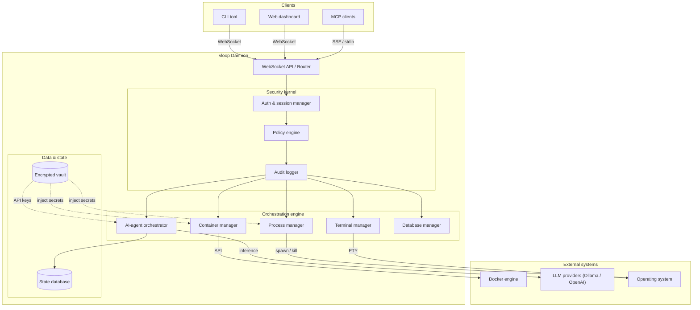

# System Architecture Overview

vloop is built as a modular, monolithic daemon (`@orch/daemon`) that integrates various subsystems into a cohesive orchestration platform. It follows a "hub-and-spoke" model where the orchestrator is a secure gateway and each package is a typed `AppComponent` that manages its own lifecycle (`register → init → start → stop → cleanup`).

## High-Level Design

The system is composed of the following key layers:

1.  **Interface Layer**:
    *   **CLI (`@orch/cli`)**: The primary command-line tool for operators.
    *   **Web UI (`@orch/web-ui`)**: A React-based dashboard for visual management.
    *   **MCP Server (`@orch/mcp-server`)**: A dedicated AppComponent running an Express server for Model Context Protocol connectivity (StreamableHTTP + SSE). Authenticates via Bearer token through SessionManager or persistent TokenManager.
    *   **WebSocket API**: The real-time, bidirectional communication channel used by all clients.

2.  **Core Daemon (`@orch/daemon` & `@orch/orchestrator`)**:
    *   **Router**: Dispatches incoming messages to appropriate feature handlers.
    *   **Security Kernel**: Enforces Authentication (JWT), Authorization (RBAC), and Audit Logging.
    *   **ComponentLifecycleManager**: Orders components by dependencies and orchestrates typed lifecycle transitions.
    *   **Gateway Runtime**: Owns shared infra (health server, websocket server, config/database wiring, session/policy enforcement).

3.  **Feature Subsystems**:
    *   **Process Manager (`@orch/process`)**: Spawns and supervises OS-level processes.
    *   **Container Manager (`@orch/container`)**: Interfaces with the Docker Engine API.
    *   **AI Orchestrator (`@orch/ai-agent`)**: Manages LLM interactions, tools, and workflows via the v2 architecture — Drizzle-backed repos for all entities (providers, models, agents, sessions, messages, workflows, canvases), Google ADK for agent execution, DAG-based message history with fork/rerun/compact, pluggable LLM adapters (Anthropic, OpenAI, Ollama, Google), Canvas server, and the ToolRegistry (published under `TOKENS.ToolRegistry` for cross-package consumption by `@orch/mcp-server`).
    *   **MCP Server (`@orch/mcp-server`)**: Owns the MCP HTTP server lifecycle. Dynamically exposes all tools from the shared ToolRegistry and validates auth tokens (session or persistent) via `@orch/auth`.
    *   **Database Manager (`@orch/db-manager`)**: Provisions SQLite/Postgres/MySQL databases.
    *   **Terminal Manager (`@orch/terminal`)**: Manages persistent PTY sessions.
    *   **Vault (`@orch/vault`)**: Securely stores secrets using AES-256-GCM encryption.

4.  **Infrastructure Layer**:
    *   **Encrypted Storage**: All state is persisted in encrypted SQLite databases (`better-sqlite3-multiple-ciphers`).
    *   **System Resources**: Direct access to file system, network, and hardware (via Node.js APIs).

## Architecture Diagram

The following diagram illustrates how the core components interact within the vloop system:

## Key Architectural Decisions

*   **Modular Monolith**: While logically separated into packages, the core system runs as a single process to minimize latency and operational complexity.
*   **Encrypted-by-Default**: The system assumes it is running in a potentially hostile environment (e.g., a shared dev machine), so all persistent state is encrypted at rest.
*   **Event-Driven**: The internal architecture heavily relies on event emitters and WebSocket messages, enabling real-time updates for all connected clients.
*   **Policy-as-Code**: Access control is defined in TOML configuration files, allowing for transparent and version-controlled security policies.
*   **Typed Lifecycle Contract**: Installed apps must implement `AppComponent`; the orchestrator validates contract shape at load time and exposes a secured admin-only lifecycle control topic.
