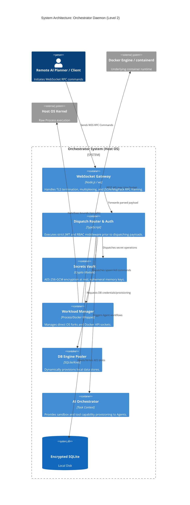
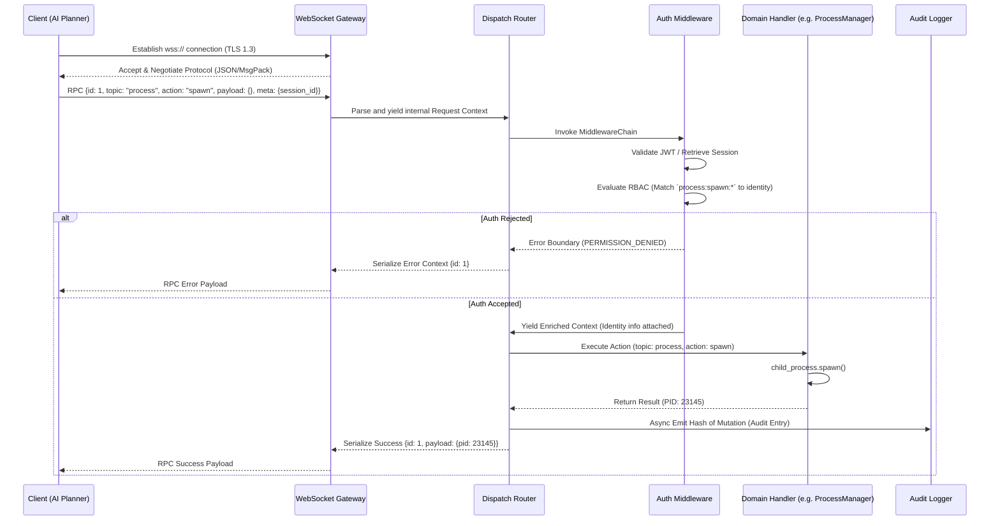

# Master Requirements & System Architecture Document (SAD)

## 1. Executive Summary & Core Requirements (PRD Overview)

### System Purpose
The **Orchestrator System** is a foundational, host-level daemon designed to act as the autonomous control plane for local execution environments. Positioned at the lowest user-space tier, it bridges the gap between overarching AI planners and raw host primitives. The daemon manages containerized workloads, native OS long-running processes (LRPs), cryptographic secret injection, and stateful database engines, exposing all capabilities exclusively through a multiplexed, strictly-authenticated WebSocket API.

### Functional Requirements
- **Workload Execution:** Must spawn, track, and forcefully terminate native Operating System Long-Running Processes (LRPs) with configurable restart policies (Always, On-Failure, Never).
- **Container Management:** Must interface with local container endpoints (Docker Engine API / `containerd`) to predictably schedule, restrict, and network isolated OCI containers.
- **RPC Gateway:** Must expose a Subprotocol-negotiated (JSON/MessagePack) WebSocket RPC gateway capable of bidirectional message routing.
- **Secrets Management:** Must operate an encrypted, zero-trust Vault for data-at-rest encryption using AES-256-GCM.
- **AI Agent Orchestration:** Must provide sandbox execution and memory context wiring for autonomous agent routines, treating agents as first-class workloads.
- **Database Engine Management:** Must dynamically provision, connect, and multiplex local database connections (e.g., SQLite, PostgreSQL) for active workflows.

### Non-Functional Requirements
- **Daemon Resilience:** The system must survive underlying subsystem crashes and recover state autonomously upon restart (Crash-Only Software design).
- **Security & RBAC:** Zero-trust interaction model. Every WebSocket message must undergo JWT validation, contextual enrichment, and strict Role-Based Access Control (RBAC) authorization before handler dispatch. All mutation actions must be irreversibly hashed into the Audit Log.
- **High Cohesion, Low Coupling:** Strict adherence to Feature-Driven Development (FDD). Cross-domain communication happens only via defined internal interfaces.
- **Latency & Throughput:** Must support high-frequency event streaming (e.g., tailing `stdout/stderr` streams of 100+ processes simultaneously) without blocking the Node.js event pool.

---

## 2. System Architecture (C4 Model - Level 2 / Containers)

The Orchestrator follows a modular monolith architecture. The Core Daemon Process acts as the central orchestrator, initializing isolated feature domains and binding them to the WebSocket Gateway.



---

## 3. Feature-Driven Directory Structure & FDD Grouping

The codebase strictly follows Feature-Driven Development (FDD). Grouping is by vertical domain (features), never by horizontal layers (controllers/services). Feature packages expose limited public `index.ts` APIs.

```text
orchestrator/
├── packages/
│   ├── daemon/          // Core infrastructure bootstrapping
│   │   ├── config/      // Zod schema config loading & Env overlays
│   │   ├── server/      // WebSocket & TLS listeners, heartbeat logic
│   │   ├── protocol/    // RPC decoding (JSON/MessagePack)
│   │   ├── router/      // Topic dispatcher and middleware chain execution
│   │   └── logging/     // Pino structural logger
│   │
│   ├── auth/            // Security, Identity & Compliance domain
│   │   ├── jwt/         // ECDSA/RSA Signature verification
│   │   ├── rbac/        // PolicyEngine parsing TOML glob definitions
│   │   ├── session/     // Lifecycle of persistent connection tokens
│   │   └── audit/       // Immutable hashed mutation logging
│   │
│   ├── vault/           // Core Cryptography & Secrets Handling
│   │   ├── crypto/      // AES-256-GCM / Argon2id KDF implementations
│   │   ├── store/       // BLOB abstraction over SQLite
│   │   └── handler/     // `vault.*` WebSocket endpoints
│   │
│   ├── process/         // Raw OS Process Execution (LRP)
│   │   ├── spawner/     // `child_process.spawn` wrappers
│   │   ├── manager/     // Restart backoff machine & state persistence
│   │   └── logs/        // Ring-buffered stdout/stderr streaming
│   │
│   ├── container/       // Isolated Workload Execution
│   │   ├── engine/      // Docker socket negotiation
│   │   ├── images/      // Automated registry pulls
│   │   └── containers/  // Volume mounting and port mapping
│   │
│   ├── db-manager/      // Multi-tenant Database Provisioning
│   │   ├── provisioner/ // Bootstraps SQLite/Postgres user-spaces
│   │   └── pooler/      // Connection tracking
│   │
│   ├── ai-agent/        // Autonomous Actor Runtime
│   │   ├── sandbox/     // Context injection boundaries
│   │   └── tools/       // Agent local function implementations
│   │
│   ├── shared/          // Cross-domain primitives
│   │   ├── errors/      // OrchestratorError & standardized ErrorCodes
│   │   └── types/       // Generic shared typings
│   │
│   └── orchestrator/    // Main Entrypoint (DI composition root)
│       └── main.ts      // Wires Domains to Router logic
```

---

## 4. Data Flow & Communication Protocols

### WebSocket RPC Lifecycle
The system utilizes a Fire-and-Forget + Promise-Resolution multiplexed architecture mapping specific `message.id` keys over native WebSockets.



### IPC (Inter-Process Communication)
- **Container Runtime (`@orch/container`):** Synchronous Unix Socket requests to `/var/run/docker.sock` mapping HTTP `POST /containers/create`. Realtime outputs mapped internally to `stream.PassThrough` wrappers tracking chunk metadata.
- **Process Spawner (`@orch/process`):** Standard `stdin/stdout/stderr` pipes via File Descriptors (FD). If advanced telemetry is activated, bounded sockets relay high-density metrics.

---

## 5. Data & Database Engine Management Strategy

### Secret Injection & State Stores
- **Root Encryption**: The Orchestrator's internal SQLite database (`core_db`) is encrypted using `better-sqlite3-multiple-ciphers` (AES-256). The Master Encryption Key (MEK) is derived at runtime from `ORCH_DB_PASSPHRASE` via Argon2id.
- **Vault Data**: User/Tenant secrets are stored symmetrically encrypted within `core_db`. The Vault module injects requested credentials directly into Container/Process environmental maps as they instantiate, completely bypassing physical disk writes.

### DB Engine Management
- **Provisioning Flow**: When an AI Agent requests a workspace, the `db-manager` domain spins up an isolated logical database (e.g., an encrypted `.sqlite` file dedicated strictly to that task, or an independent schema in a running PostgreSQL container).
- **Federation Strategy**: The Orchestrator does not run complex SQL joins logic for external tools. It acts as the credential broker and proxy connector, handing ephemeral access tokens (Vault-derived) to workloads that directly interface with their assigned compute DBs.
