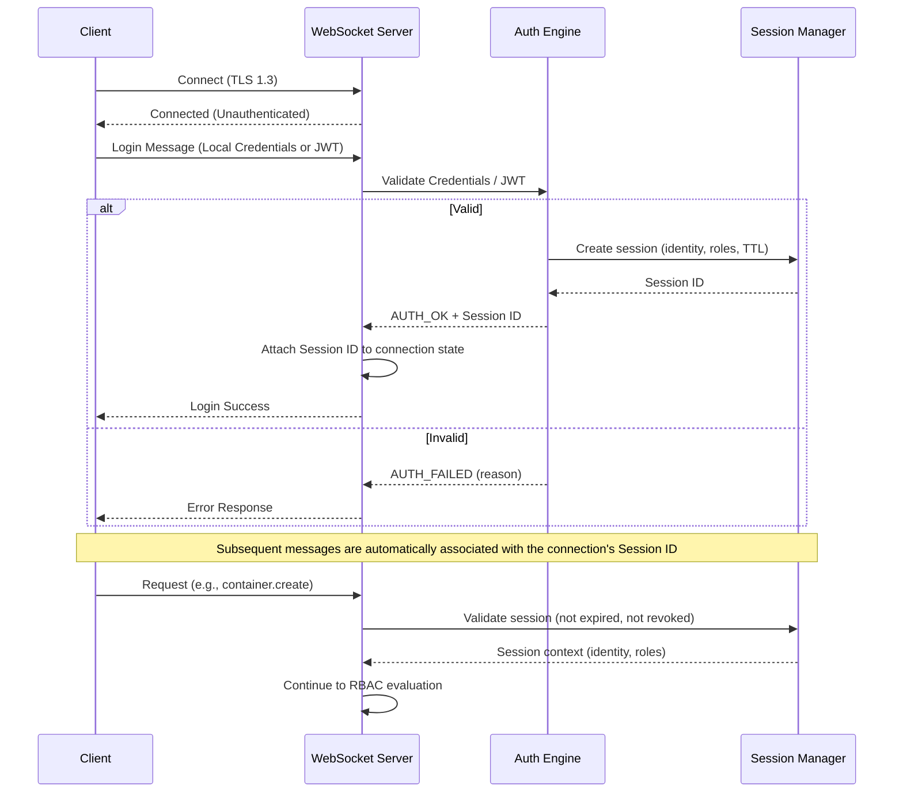

# PRD: Authentication & Session Management (FS-2)

| Field | Value |
|---|---|
| **Status** | Draft |
| **Date** | 2026-02-22 |
| **Feature Set** | FS-2: Auth & Session Management |
| **Dependencies** | FS-1 (Core Daemon), FS-9 (Secrets Vault) |

---

## 1. Problem Statement

Every WebSocket connection must be authenticated and every message authorized before reaching a feature handler. The system needs a flexible, policy-driven access control layer that supports both human operators and machine-to-machine (AI agent) authentication.

## 2. Goals

1. Authenticate connections via JWT bearer tokens or mTLS client certificates.
2. Issue short-lived session tokens with configurable TTL and refresh.
3. Enforce RBAC with resource-scoped permissions on every message.
4. Maintain an immutable audit trail of all mutations.
5. Support hot-reloading of RBAC policies without daemon restart.

## 3. Non-Goals

- OAuth2 authorization server (we consume tokens, not issue them).
- User management UI (managed externally).
- Multi-tenancy isolation (single-tenant daemon).

---

## 4. Authentication Flow



### Supported Auth Methods

| Method | Mechanism | Use Case |
|---|---|---|
| **Local Users** | Username and password (bcrypt) sent via `auth.login` message | Human operators, Admin UI |
| **Dynamic JWT** | JWT sent via `auth.login` message, validated against whitelisted JWKS providers | CI/CD, External API clients |
| **Internal Routing** | Direct `router.dispatch` calls with injected session context | Service-to-service, AI agents |

---

## 5. Functional Requirements

### FR-1: Local User Authentication

| ID | Requirement |
|---|---|
| FR-1.1 | Support local user creation, update, and deletion (admin only). |
| FR-1.2 | Store passwords securely using bcrypt hashing. |
| FR-1.3 | Authenticate users via `auth.login` message with username and password. |
| FR-1.4 | Assign roles to local users for RBAC enforcement. |

### FR-2: Dynamic JWT Authentication

| ID | Requirement |
|---|---|
| FR-2.1 | Support dynamic registration of JWT providers (issuer, JWKS URL, role mapping). |
| FR-2.2 | Authenticate users via `auth.login` message with a JWT token. |
| FR-2.3 | Verify signature using dynamically fetched JWKS from the provider. |
| FR-2.4 | Validate standard claims: `exp`, `nbf`, `iss`, `aud`. |
| FR-2.5 | Map JWT claims to internal roles based on provider configuration. |

### FR-3: Session Management

| ID | Requirement |
|---|---|
| FR-3.1 | Create a session upon successful authentication. Generate a session token (opaque, 256-bit random). |
| FR-3.2 | Session stores: identity, roles, creation time, last activity, expiry, connection metadata. |
| FR-3.3 | Sessions expire after configurable idle timeout (default 1 hour) and max lifetime (default 24 hours). |
| FR-3.4 | Support session refresh: client sends `session.refresh` action to extend idle timeout. |
| FR-3.5 | Enforce max concurrent sessions per identity (configurable, default 10). |
| FR-3.6 | Revoke sessions explicitly via `session.revoke` action or automatically on connection close. |
| FR-3.7 | Persist active sessions in SQLite for crash recovery. Expire stale sessions on restart. |

### FR-4: RBAC Policy Engine

| ID | Requirement |
|---|---|
| FR-4.1 | Define roles in a TOML policy file. Each role has a list of permission grants. |
| FR-4.2 | Permission format: `<topic>:<action>:<resource_pattern>` (e.g., `container:create:*`, `vault:secret.get:db-*`). |
| FR-4.3 | Resource patterns support glob matching (`*` = any, `db-*` = prefix match). |
| FR-4.4 | Evaluate every inbound message against the session's roles. Deny by default. |
| FR-4.5 | Return `PERMISSION_DENIED` error with the required permission in the response. |
| FR-4.6 | Support policy hot-reload via `SIGHUP` or `admin.policy.reload` action. |

#### RBAC Policy Example

```toml
# /etc/orchestrator/policies.toml

[roles.admin]
description = "Full system access"
permissions = ["*:*:*"]

[roles.operator]
description = "Manage containers and processes"
permissions = [
    "container:*:*",
    "process:*:*",
    "vault:secret.get:*",
]

[roles.agent]
description = "AI agent - limited access"
permissions = [
    "container:create:agent-*",
    "container:stop:agent-*",
    "process:create:agent-*",
    "vault:secret.get:agent-*",
    "agent:*:self",
]

[roles.viewer]
description = "Read-only access"
permissions = [
    "container:list:*",
    "container:inspect:*",
    "process:list:*",
    "health:*:*",
]
```

### FR-5: Audit Logger

| ID | Requirement |
|---|---|
| FR-5.1 | Log every mutation (non-read) action with: timestamp, session_id, identity, topic, action, resource, outcome (allow/deny), trace_id. |
| FR-5.2 | Audit logs stored in a dedicated SQLite table (append-only). |
| FR-5.3 | Support audit log export via `admin.audit.query` action (admin role only). |
| FR-5.4 | Audit log entries are tamper-evident: each entry includes a hash chain linking to the previous entry. |

---

## 6. Data Model

```sql
-- Local Users
CREATE TABLE users (
    id            TEXT PRIMARY KEY,
    username      TEXT UNIQUE NOT NULL,
    password_hash TEXT NOT NULL,
    roles         TEXT NOT NULL, -- JSON array
    created_at    TEXT NOT NULL,
    updated_at    TEXT NOT NULL
);

-- JWT Providers
CREATE TABLE jwt_providers (
    id         TEXT PRIMARY KEY,
    name       TEXT NOT NULL,
    issuer     TEXT UNIQUE NOT NULL,
    jwks_url   TEXT NOT NULL,
    role_map   TEXT NOT NULL, -- JSON object mapping claims to roles
    created_at TEXT NOT NULL,
    updated_at TEXT NOT NULL
);

-- Active sessions
CREATE TABLE sessions (
    id          TEXT PRIMARY KEY,    -- Session ID (UUIDv7)
    identity    TEXT NOT NULL,
    roles       TEXT NOT NULL,       -- JSON array of role names
    created_at  TEXT NOT NULL,
    last_active TEXT NOT NULL,
    expires_at  TEXT NOT NULL,
    conn_meta   TEXT,               -- JSON: remote_addr, user_agent, etc.
    revoked     INTEGER DEFAULT 0
);

-- Audit log
CREATE TABLE audit_log (
    id          INTEGER PRIMARY KEY AUTOINCREMENT,
    timestamp   TEXT NOT NULL,
    session_id  TEXT,
    identity    TEXT NOT NULL,
    topic       TEXT NOT NULL,
    action      TEXT NOT NULL,
    resource    TEXT,
    outcome     TEXT NOT NULL,       -- "allowed" | "denied"
    trace_id    TEXT,
    prev_hash   TEXT,               -- Hash chain
    entry_hash  TEXT NOT NULL        -- SHA-256(prev_hash + entry data)
);
```

---

## 7. WebSocket API

### Topic: `auth`

| Action | Direction | Payload | Response |
|---|---|---|---|
| `login` | Client → Server | `{type: "local", username, password}` or `{type: "jwt", token}` | `{session_id, identity, roles, expires_at}` |
| `user.create` | Client → Server | `{username, password, roles}` | `{id, username, roles}` (admin) |
| `user.list` | Client → Server | `{}` | `{users: [...]}` (admin) |
| `user.delete` | Client → Server | `{id}` | `{ok: true}` (admin) |
| `provider.create` | Client → Server | `{name, issuer, jwks_url, role_map}` | `{id, name, issuer}` (admin) |
| `provider.list` | Client → Server | `{}` | `{providers: [...]}` (admin) |
| `provider.delete` | Client → Server | `{id}` | `{ok: true}` (admin) |

### Topic: `session`

| Action | Direction | Payload | Response |
|---|---|---|---|
| `session.info` | Client → Server | `{}` | `{session_id, identity, roles, expires_at}` |
| `session.refresh` | Client → Server | `{}` | `{session_id, new_expires_at}` |
| `session.revoke` | Client → Server | `{session_id?}` | `{ok: true}` |
| `session.list` | Client → Server | `{}` | `{sessions: [{id, identity, created_at, last_active}]}` (admin) |

### Topic: `admin`

| Action | Direction | Payload | Response |
|---|---|---|---|
| `policy.reload` | Client → Server | `{}` | `{ok: true, roles_loaded: N}` (admin) |
| `audit.query` | Client → Server | `{from?, to?, identity?, topic?, limit?}` | `{entries: [...]}` (admin) |

---

## 8. Acceptance Criteria

| # | Criterion |
|---|---|
| AC-1 | Valid `auth.login` message establishes a session; invalid credentials return `AUTH_FAILED`. |
| AC-2 | Session expires after idle timeout; subsequent messages return `SESSION_EXPIRED`. |
| AC-3 | `session.refresh` extends the session; `session.revoke` immediately invalidates it. |
| AC-4 | A `viewer` role can `container:list` but cannot `container:create` (denied with `PERMISSION_DENIED`). |
| AC-5 | Policy file changes are picked up on `SIGHUP` without restarting the daemon. |
| AC-6 | Audit log captures all mutations with correct identity, action, and outcome. |
| AC-7 | Audit log hash chain is verifiable (each entry hash links to previous). |
| AC-8 | Admin can create local users and dynamic JWT providers via WebSocket API. |
