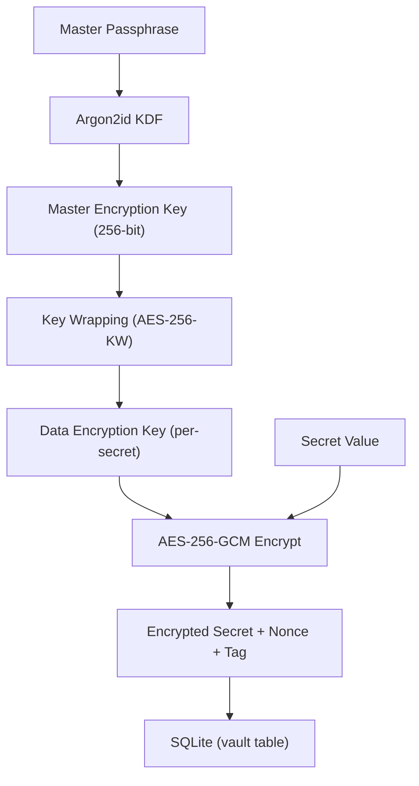

# PRD: Secrets Vault (FS-9)

| Field | Value |
|---|---|
| **Status** | Draft |
| **Date** | 2026-02-22 |
| **Feature Set** | FS-9: Secrets Vault |
| **Dependencies** | FS-1 (Core Daemon) |

---

## 1. Problem Statement

The Orchestrator manages credentials for databases, containers, plugins, and device access. These secrets must be encrypted at rest, decryptable only in-memory, and injectable into workloads. Without a centralised vault, credentials would be scattered across config files in plaintext.

## 2. Goals

1. Store secrets encrypted at rest using AES-256-GCM.
2. Derive encryption keys from a master passphrase via Argon2id.
3. Provide CRUD + list + versioning for secrets.
4. Inject secrets as environment variables into containers and LRPs.
5. Support policy-driven auto-rotation with hooks.

## 3. Non-Goals

- HSM / TPM integration (future enhancement).
- Multi-user vault access (single daemon-level vault).
- External vault federation (e.g., HashiCorp Vault proxy — future).

---

## 4. Encryption Architecture



| Layer | Detail |
|---|---|
| **KDF** | Argon2id with configurable memory (64 MiB default), iterations (3), parallelism (4). |
| **MEK** | Derived at daemon startup from passphrase. Held in-memory only. Zeroed on shutdown. |
| **DEK** | Unique per secret. Wrapped (encrypted) with MEK before storage. |
| **Encryption** | AES-256-GCM with random 96-bit nonce per encryption operation. |

---

## 5. Functional Requirements

### FR-1: Vault Initialization

| ID | Requirement |
|---|---|
| FR-1.1 | On first run, prompt for or accept a master passphrase via env var (`ORCH_VAULT_PASSPHRASE`) or config. |
| FR-1.2 | Derive MEK using Argon2id. Store the Argon2 salt and parameters (not the MEK) in the vault metadata table. |
| FR-1.3 | On subsequent starts, derive MEK from passphrase + stored salt. Verify via a sentinel value. |
| FR-1.4 | If passphrase is incorrect, abort startup with a clear error. |

### FR-2: Secret CRUD

| ID | Requirement |
|---|---|
| FR-2.1 | **Create**: Store a new secret (name, value, metadata). Generate a DEK, encrypt value, wrap DEK, persist. |
| FR-2.2 | **Read**: Unwrap DEK with MEK, decrypt value, return plaintext. Never persist plaintext. |
| FR-2.3 | **Update**: Create a new version of the secret. Previous versions retained (configurable max versions, default 5). |
| FR-2.4 | **Delete**: Soft-delete by default (mark as deleted, retain for configurable retention period). Hard-delete available. |
| FR-2.5 | **List**: Return secret names and metadata (never values) with pagination. |

### FR-3: Secret Injection

| ID | Requirement |
|---|---|
| FR-3.1 | Inject secrets as environment variables when spawning containers or LRPs. |
| FR-3.2 | Support template syntax in config: `${vault:secret_name}` resolved at injection time. |
| FR-3.3 | Secrets are decrypted in-memory only at injection time, never written to disk in plaintext. |

### FR-4: Auto-Rotation (P2)

| ID | Requirement |
|---|---|
| FR-4.1 | Define rotation policies per secret (e.g., rotate every 30 days). |
| FR-4.2 | On rotation: generate new value, store as new version, execute optional rotation hook (e.g., update DB password). |
| FR-4.3 | Emit a `vault.secret.rotated` event over WebSocket for subscribers. |

---

## 6. Storage Schema

```sql
-- Vault metadata
CREATE TABLE vault_meta (
    key   TEXT PRIMARY KEY,
    value BLOB NOT NULL
);
-- Stores: argon2_salt, argon2_params, sentinel_ciphertext

-- Secrets
CREATE TABLE secrets (
    id         TEXT PRIMARY KEY,  -- UUIDv7
    name       TEXT NOT NULL UNIQUE,
    version    INTEGER NOT NULL DEFAULT 1,
    wrapped_dek BLOB NOT NULL,   -- DEK encrypted with MEK
    ciphertext BLOB NOT NULL,    -- Secret value encrypted with DEK
    nonce      BLOB NOT NULL,    -- 96-bit GCM nonce
    tag        BLOB NOT NULL,    -- 128-bit GCM auth tag
    metadata   TEXT,             -- JSON: labels, rotation_policy, etc.
    created_at TEXT NOT NULL,
    deleted_at TEXT,             -- Soft delete timestamp
    UNIQUE(name, version)
);
```

---

## 7. WebSocket API

### Topic: `vault`

| Action | Direction | Payload | Response |
|---|---|---|---|
| `secret.create` | Client → Server | `{name, value, metadata?}` | `{id, name, version}` |
| `secret.get` | Client → Server | `{name, version?}` | `{name, value, version, metadata}` |
| `secret.update` | Client → Server | `{name, value, metadata?}` | `{id, name, version}` |
| `secret.delete` | Client → Server | `{name, hard?: bool}` | `{ok: true}` |
| `secret.list` | Client → Server | `{prefix?, limit?, offset?}` | `{secrets: [{name, version, created_at, metadata}]}` |
| `secret.rotated` | Server → Client | — | `{name, version, rotated_at}` (event) |

---

## 8. Acceptance Criteria

| # | Criterion |
|---|---|
| AC-1 | Vault initializes with a passphrase, creates salt, and stores sentinel. |
| AC-2 | Incorrect passphrase on restart is rejected with a clear error. |
| AC-3 | Create → Get round-trip returns the original plaintext value. |
| AC-4 | Update creates a new version; previous version is retrievable by version number. |
| AC-5 | List never returns secret values, only names and metadata. |
| AC-6 | SQLite database file is unreadable without the MEK (all secrets encrypted). |
| AC-7 | On daemon shutdown, MEK is zeroed from memory (verified via test). |
