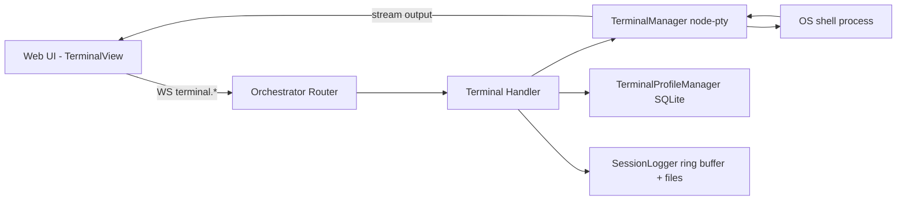

# Terminal Feature

## Overview

The terminal subsystem adds interactive shell access to the orchestrator stack using:

- **Backend PTY runtime:** `@orch/terminal` with `node-pty`
- **Transport:** WebSocket topic `terminal`
- **Frontend renderer:** `@xterm/xterm` + fit/web-links add-ons
- **Policy enforcement:** role-based checks + shell/input filtering
- **Persistence:** session scrollback and on-disk logs in `data/terminal-logs/`

## Architecture

## WebSocket Actions

Topic: `terminal`

| Action | Purpose |
|---|---|
| `spawn` | Spawn a new PTY session |
| `write` | Send input bytes to PTY |
| `resize` | Resize cols/rows |
| `kill` | Terminate session |
| `list` | List active sessions |
| `scrollback` | Get buffered output |
| `profile.list` | List terminal profiles |
| `profile.create` | Create profile |
| `profile.update` | Update profile |
| `profile.delete` | Delete profile |

### Spawn stream behavior

`spawn` wires PTY output through stream events:

- output chunk payload: `{ sessionId, data }`
- exit payload: `{ sessionId, type: 'exit', exitCode, signal }`

## Permission Model

Default policy (`DEFAULT_TERMINAL_POLICY`):

- Allowed roles: `admin`, `operator`
- Max concurrent sessions per identity: `5`
- Optional shell allow/block lists
- Input block patterns (best-effort command filtering)

`write` requests are validated against block patterns before passing data to the PTY.

## Profiles

Terminal profiles are stored in `terminal_profiles` SQLite table.

Profile shape:

- `id`, `name`, `owner`
- `shell`, `args`, `cwd`, `env`
- `startupCommands`
- `isDefault`
- `createdAt`, `updatedAt`

## Health + AI Tooling

Orchestrator startup registers:

- `terminal` topic handler
- health subsystem `terminal` (`active session` count)
- AI tool `terminal_execute` for command dispatch

## Frontend Usage

The UI route `/terminal` supports:

- multi-session tabs
- profile selection
- optional shell/cwd overrides
- live stream output in xterm
- session kill, clear, and scrollback export

## Security Notes

Terminal access is security-sensitive. Keep these guardrails enabled:

1. Restrict terminal roles in policy
2. Keep input block patterns up to date
3. Prefer per-user profile ownership
4. Audit and rotate terminal logs in `data/terminal-logs/`
